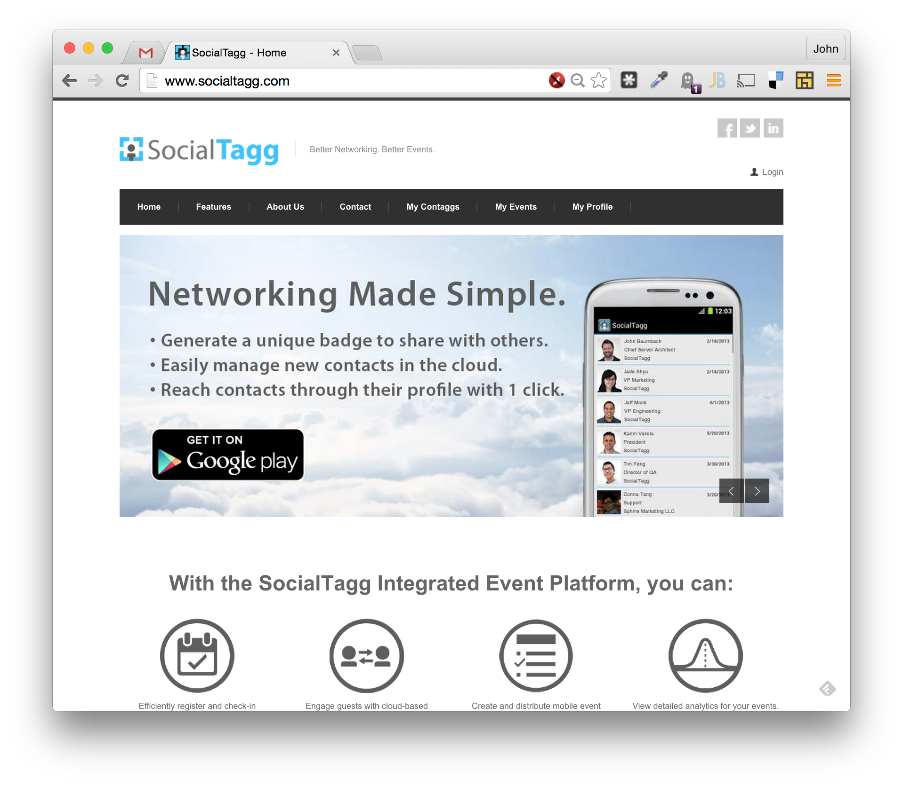

# SocialTagg Node.js Website
This was my first application in the open source world after being a professional developer in the enterprise/Microsoft world for 10 years.
Its an interesting stroll down memory lane.  :)
Social Tagg was started by some friends from Fandango where I worked at the time, and I jumped at the opportunity to build
something cool using Node from scratch, the red-hot New Thing™ at the time.  I've since grown to love Node and Angular, and Social Tagg
has long since ceased operations, so here's my code.

The source control system was SVN so there's not much Git history, but it's just as I left it when the startup ceased operations.

Here are some screenshots.



## -- Original Readme --
This is the source code of the SocialTagg website.  It includes these general features:

* Built with Node.js and Express
* REST API with authentication scheme
* Fully commented for people coming from a Microsoft .NET/RDBMS background
* Data layer demonstrating connecting to and storing data in UserGrid and/or MongoDb
* Data layer decoupled from application layer for easily changing databases
* Defined classes (well, Javascript's version of a class) for application object models
* User account create/edit, demonstrating password hashing and salting
* User login with sessions stored in Redis
* Presentation layer using layouts (e.g. "master pages" in .NET Webforms) and includes (e.g. "user controls")
* HTML generated using Jade rendering engine, also demonstrating conditionals
* CSS generated using Stylus rendering engine (with Nib plugin for abstracting away CSS hacks, thank you http://clock.co.uk/tech-blogs/a-simple-website-in-nodejs-with-express-jade-and-stylus)
* Unit and integration testing architecture with Mocha
* HTML black box testing demonstration with Supertest
* Load testing your application with Nodeload
* Deploy your app to production at Heroku

## Quick Start

* Install node.js on your system.
* Clone this repo.
* Install dependencies
    ```
    $ npm install
    $ bower install
    ```
* Make sure Redis is set up and the server is started:
    ```
    $ redis-server
    ```
* Fire up the application server:
    ```
    $ node app
    ```
If all goes well, the startup message will show the url to copy to your browser to see the app in action.

## Running Tests

To run the test suite, execute this command.  Note that the integration tests depend on an existing test
user, so be sure to create that and update the source code values.  Otherwise, some of these will bomb out:

```
$ mocha --recursive --reporter spec
```
To run the load test (runs for 2 minutes):
```
$ node loadtest.js
```
## Day to day Assembla and Heroku operations

The SocialTagg website uses Assembla+SVN for general source control operations, and Heroku uses GIT for
deployment to the production website.

This is a bit of a headache since you have not one but two source control systems using your code at the same
time.  Here are the general things you need to do:

* Get the source from Assembla+SVN.  We're using 1.7+.  This should create a local .svn directory.
* By default, Mac comes with SVN 1.6.  You need to update your local SVN so that command line operations will work.  This is a pain in the @ss
since brew doesn't update it properly.  I used brew first since it installs a bunch of dependencies (especially "neon"), then
when it fails d/l the source directly from Apache and manually build it.  This is a good guide, if you use brew you can start
with step #3: http://blog.countableset.ch/2013/01/10/compile-svn-for-osx/
* When the step above is done, you'll probably have two SVN versions installed (1.6 and 1.7).  Follow the instructions
here about getting the right one to run in your terminal: http://superuser.com/questions/455214/where-is-svn-on-os-x-mountain-lion
* Be sure to ignore the .git and .idea directories in SVN.  Here's a guide to do that: http://stackoverflow.com/questions/116074/how-to-ignore-a-directory-with-svn
* There's a .gitignore file in SVN.  It ignores all the SVN files by default, so you should be good there.
* Tell Webstorm (the preferred Node.js editor) to use SVN for source control ("CMD-,", then "Project Properties", "Source Control").
* Deploy to production easily with the bash script:
    ```
    $ ./deploy-to-heroku.sh
    ```
* Other commands:
    ```
    $ heroku logs [-t] [--remote staging/heroku]  # See what broke, if anything.  -t is real-time streaming
    $ heroku releases # See the release history for your site
    $ heroku rollback [release] # Rollback to most recent release or specified release (e.g. v43)
    $ heroku run bash  # open a bash shell in your environment (not an existing dyno tho - good for running migrations)
    $ heroku run:detached [command]  # run a script from your app, like migrations
    $ heroku ps     # Gets status of all dynos, use -- remote heroku or -- remote staging
    ```
* SVN error: "SVN commit failed: Directory out of date".  This happens when you rename a directory in a way SVN doesn't like.  To fix:
    ```
    $ svn update   # See: http://stackoverflow.com/questions/3298384/svn-commit-failed-directory-out-of-date
    ```
* Edit ignored directories in SVN (must have 'export SVN_EDITOR=pico' (no quotes) in ~/.bash_profile):
    ```
    $ svn propget -R svn:ignore .   # view
    $ svn propedit svn:ignore .     # edit w/current editor from ~/.bash_profile
    ```
    Setting a domain name set up in Godaddy to point to a Heroku app (e.g. staging)
    // See doc here: https://devcenter.heroku.com/articles/custom-domains
    ```
    $ heroku domains:add staging.socialtagg.com --remote staging
    ```
* Push a special branch to Heroku:
    ```
    $ git push staging jb_sentry_integration:master   # replaces "master" with "jb_sentry_integration"
    ```
## Third-party Components

In the open source world, new updates are released often.  To list your versions:
```
$ npm list
```
To install/update components (gets the code from npm for the version listed in package.json):
```
$ npm update [component]
```
Be sure to run all the tests after updating your components.  Something may have broken.

When adding a new component, be sure to update the package.json file with the dependency.  Otherwise, Heroku won't
load it, and the site will be sad.  The package.json file should match npm list. I
can't confirm, but I think that Heroku only cares about the version of Node.  The
other modules are loaded by npm and you can use what you want.
  
## SSL Certs on Heroku

Follow the instructions about adding the SSL add-on on the Heroku site.  Refer to the document "socialtagg-entered-csr-data.txt"
which may or may not be in Assembla.  :)

## Heroku Staging Environment

From instructions on heroku: https://devcenter.heroku.com/articles/multiple-environments#starting-with-a-production-app
This may be required as well: http://stackoverflow.com/questions/14161621/key-with-fingerprint-not-authorized-in-heroku
```
$ heroku create --remote staging --addons redistogo:nano
Creating evening-ocean-8134... done, region is us
Adding redistogo:nano to evening-ocean-8134... done
http://evening-ocean-8134.herokuapp.com/ | git@heroku.com:evening-ocean-8134.git
Git remote staging added
```
Most likely you'll have to create a new key to access it:
```
$ ssh-keygen -t rsa -f ~/.ssh/identity.herokustage.tagg
```
Add the key to the ssh-agent (** also redo this if Heroku suddenly stops working even though it was set up ok for a while):
```
$ ssh-add ~/.ssh/identity.herokustage.tagg  # (use an easily remembered PW, you'll need it periodically)
```
Make sure your key is in the agent:
```
$ ssh-add -l
```
Add it to heroku:
```
$ heroku keys:add ~/.ssh/identity.herokustage.tagg.pub
```
Then, push to staging and test it:
```
$ git push staging master
```
    
## Environment Variables

On OSX 10.8 Mountain Lion, you can temporarily set the NODE_ENV environment variable like so:
```
$ export NODE_ENV=staging
```
On Heroku staging:
```
$ heroku config:set NODE_ENV=staging  --remote staging
```
On Heroku production:
```
$ heroku config:set NODE_ENV=production  --remote heroku
```

## Error logging and reporting
 
Client-side javascript errors are reported using "Sentry".  This captures all unhandled javascript
exceptions and reports them (including stack traces) in an easy interface.

To view the exceptions, log into Heroku, find the app settings, click on "Sentry", and viola.

The "Raven" library does the talking to Sentry.  Read up on it here:  http://raven-js.readthedocs.org/en/latest/install/index.html

## Misc Info

The HTML template used by SocialTagg's website is here: http://vasterad.com/themes/centum/shortcodes.html

(Not tested) If multiple heroku accounts, install this: https://github.com/ddollar/heroku-accounts
```
$ heroku accounts
$ heroku accounts:set tagg
```
Then follow the instructions here: http://stackoverflow.com/questions/4663103/multiple-heroku-accounts
  
svn will occasionally stop working through Webstorm.  The symptom is the error
"The resource can only be on one place" or some such nonsense.  Then you have
to commit manually:
```
$ svn commit -m "Added validation for user profile info."
```
